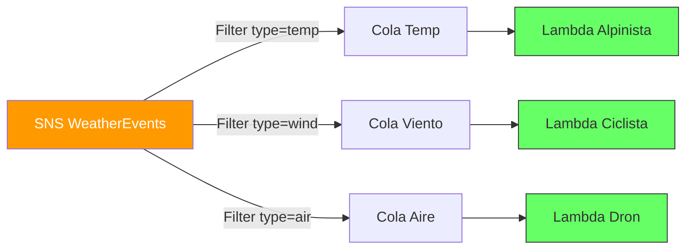

# Guía Maestra: Arquitectura de Eventos (Filtering)

## 📌 Introducción: ¿Por qué esta arquitectura?

Pasamos de un patrón "Monolito" (una Lambda que hace todo) a **Microservicios Desacoplados**.

### Visualización del Cambio

**Antes (Monolito):**
1 Cola -> 1 Lambda con muchos `if/else`. Si falla la lógica de viento, bloquea la de temperatura.

**Ahora (Filtering / Fan-out):**
SNS actúa como "Router" inteligente.
*   **1 SNS** = Entrada única.
*   **3 Colas SQS** = Zonas de trabajo aisladas.
*   **3 Lambdas** = Cerebros especialistas.



---

## 🚀 Implementación

Este proyecto está dividido en dos carpetas para que entiendas la evolución:

### 📂 01_Local_MySQL
**Objetivo:** Simular la arquitectura en tu PC antes de subir a la nube.
*   **Producer:** `SNS_Producer_events.py` (Envía a AWS SNS real).
*   **Consumer:** 3 Scripts de Python (`Lambda_Alpinista_Local.py`, etc.) corriendo en tu terminal que actúan como Lambdas.
*   **Base de Datos:** MySQL Local.

### 📂 02_Cloud_DynamoDB
**Objetivo:** Arquitectura final "Serverless" 100% en AWS.
*   **Producer:** El mismo `SNS_Producer_events.py`.
*   **Consumer:** Lambdas reales en AWS.
*   **Base de Datos:** DynamoDB (NoSQL).

---

## Guía Paso a Paso (Infraestructura AWS Común)

Para que cualqueira de los dos funcione, necesitas configurar **SNS y SQS en AWS**:

### 1. Configurar SNS (El Megáfono)
1.  **AWS Console** -> **SNS** -> **Create topic**.
2.  Tipo: **Standard**.
3.  Nombre: `WeatherEventsTopic`.
4.  Copia el **ARN**.
5.  Pégalo en `SNS_Producer_events.py` (Variable `TargetArn`).

### 2. Configurar SQS (Los Buzones)
Crea 3 colas en **SQS**:
*   `weather_alpinista`
*   `weather_ciclista`
*   `weather_dron`

### 3. Crear Suscripciones (El Link)
En el SNS Topic, crea 3 suscripciones, una a cada cola, con su **Subscription Filter Policy**:

*   **Cola Alpinista:**
    ```json
    {"eventType": ["temperature-sensor", "wind-sensor"]}
    ```
*   **Cola Ciclista:**
    ```json
    {"eventType": ["AirQualit-sensor", "visibility-sensor"]}
    ```
*   **Cola Dron:**
    ```json
    {"eventType": ["wind-sensor", "visibility-sensor"]}
    ```

---

## Ejecución

### Opción A (Local)
1.  Ve a `01_Local_MySQL`.
2.  Ejecuta `setup_local_mysql.py` (una sola vez).
3.  Abre 3 terminales y lanza los 3 scripts `Lambda_*_Local.py`.
4.  Lanza el productor.

### Opción B (Cloud)
1.  Ve a `02_Cloud_DynamoDB`.
2.  Sigue la `Guia_Cloud_Lambdas.md` para crear las tablas DynamoDB y subir el código Lambda a AWS.
